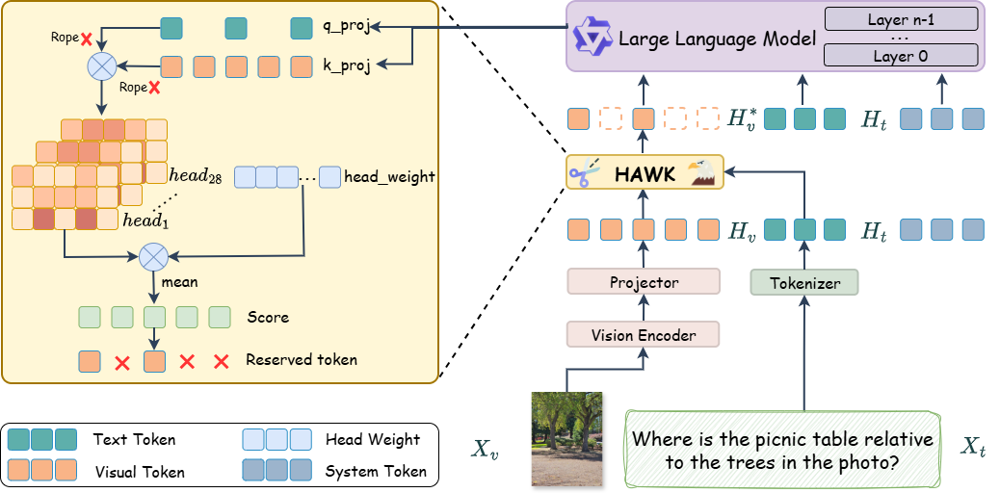
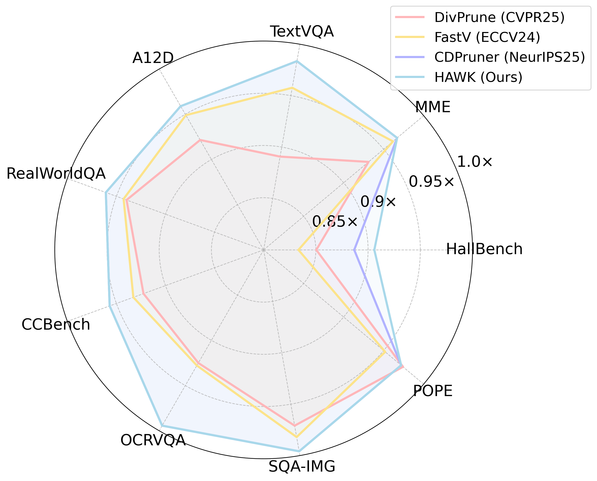

# HAWK: Head Importance-Aware Visual Token Pruning in Multimodal Models

> Accepted to CVPR 2026

HAWK is a training-free visual token pruning framework for multimodal large language models (MLLMs). Instead of assuming that all attention heads contribute equally to visual understanding, HAWK estimates static head importance offline and combines it with dynamic text-guided attention during inference. This leads to more accurate visual token selection and a better efficiency-accuracy trade-off on both image and video benchmarks.

The public paper / arXiv link will be added here once it is available.

## Overview



MLLMs often consume hundreds or even thousands of visual tokens, which significantly increases inference cost. Existing pruning methods usually rely on similarity heuristics or plain attention averaging across heads. HAWK is motivated by a simple observation: different attention heads contribute unequally to visual understanding. Based on this, HAWK:

- computes static visual head importance weights from offline head ablation,
- measures dynamic text-guided visual relevance during inference, and
- combines both signals to retain the most task-critical visual tokens.

Because the method is entirely training-free, it can be plugged into existing MLLMs without additional fine-tuning.

## Highlights

- Training-free and plug-and-play visual token pruning for MLLMs.
- Preserves **96.0%** of the original performance on **Qwen2.5-VL-7B** while pruning **80.2%** of visual tokens.
- Preserves **94.1%** of the original performance on **InternVL3-8B** with **80%** token pruning.
- Preserves **96.6%** of the original performance on video benchmarks with **80%** pruning.
- Reduces end-to-end latency to **74.4%** of the original runtime and lowers KV cache / GPU memory usage.

## Main Result



On fixed-resolution image benchmarks for Qwen2.5-VL-7B, HAWK consistently outperforms representative baselines including DivPrune, FastV, and CDPruner across a wide range of tasks.

## Method At A Glance

1. **Offline head importance estimation.** We ablate visual attention heads on multiple benchmark datasets and convert the resulting performance drops into normalized head weights.
2. **Dynamic text-guided attention.** We compute text-to-vision relevance scores from the first attention layer, intentionally removing RoPE in this step to avoid positional bias.
3. **Head importance-aware pruning.** We aggregate per-head token scores with the learned head weights and keep the top-k visual tokens for the downstream LLM layers.

## Selected Results

- **Qwen2.5-VL-7B, fixed resolution:** HAWK retains 99.0%, 96.0%, and 90.0% relative performance when pruning 60.5%, 80.2%, and 90.1% of visual tokens, respectively.
- **Qwen2.5-VL-7B, native resolution:** HAWK retains 99.6%, 96.2%, and 89.7% relative performance at 60%, 80%, and 90% pruning ratios.
- **InternVL3-8B:** HAWK retains 98.2% and 94.1% relative performance at 60% and 80% pruning ratios.
- **Video understanding:** HAWK retains 98.8%, 96.6%, and 93.7% relative performance on VideoMME and WorldSense at 60%, 80%, and 90% pruning ratios.
- **Efficiency on MME:** At pruning ratio 0.8, HAWK reaches an MME score of 2311.0 with **1.34x** end-to-end speedup, while reducing KV cache from **668 MB** to **148 MB** and GPU memory from **16.9 GB** to **15.7 GB**.

## Repository Status

This repository is currently being prepared for the public code release. We will gradually add:

- the core pruning implementation,
- model integration for supported MLLMs,
- evaluation scripts and configs,
- precomputed head-importance weights, and
- reproduction instructions for the paper results.

## Citation

If you find this project useful, please consider citing:

```bibtex
@inproceedings{zhu2026hawk,
  title={HAWK: Head Importance-Aware Visual Token Pruning in Multimodal Models},
  author={Zhu, Qihui and Zhang, Tao and Wang, Yuchen and Wen, Zijian and Zhang, Mengjie and Chen, Shuangwu and Tan, Xiaobin and Yang, Jian and Liu, Yang and Dong, Zhenhua and Yu, Xianzhi and Pan, Yinfei},
  booktitle={Proceedings of the IEEE/CVF Conference on Computer Vision and Pattern Recognition (CVPR)},
  year={2026}
}
```
