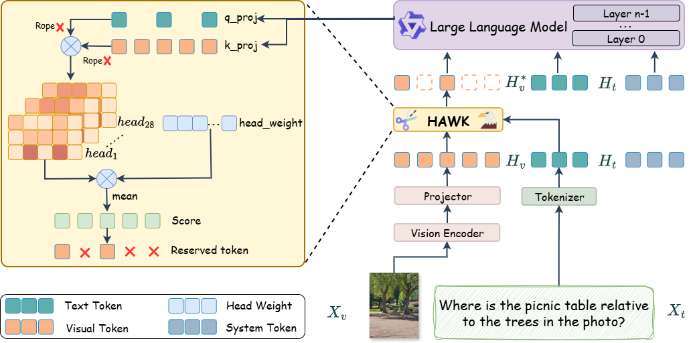
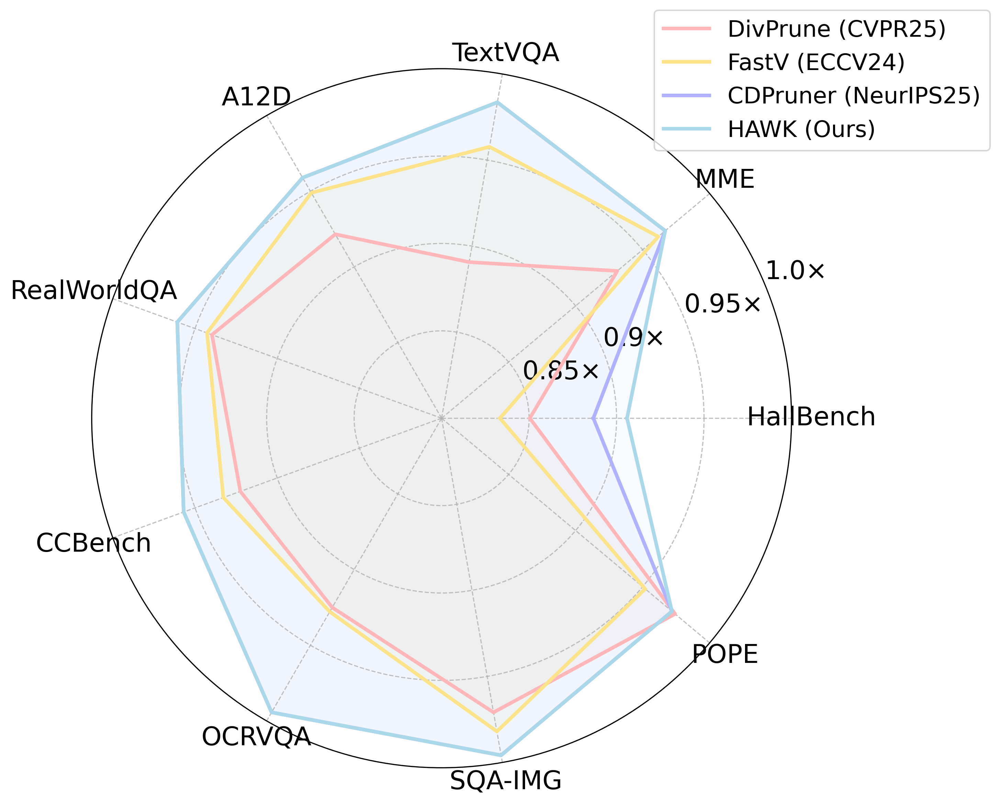

<div align="center">

# HAWK

### Head Importance-Aware Visual Token Pruning in Multimodal Models

**CVPR 2026**

[](https://arxiv.org/abs/2604.07812)
[](https://cvpr.thecvf.com/)
[](https://huggingface.co/Qwen/Qwen2.5-VL-7B-Instruct)
[](LICENSE)

**Training-free visual token pruning that combines static head importance with dynamic text-guided relevance.**

[English](README.md) | [简体中文](README_zh.md)

</div>

---

## Overview

Visual tokens dominate the context length of multimodal large language models. HAWK removes redundant visual tokens before the full language-model forward pass while preserving tokens that matter for the current instruction. It requires no training or fine-tuning.

<p align="center">
  
</p>

HAWK has three ingredients:

1. **Static visual-head importance** estimated offline through head ablation.
2. **Dynamic text-guided relevance** computed from first-layer text-to-vision QK scores without RoPE.
3. **Importance-aware top-k pruning** that aggregates per-head scores and preserves the original order and multimodal position IDs of retained tokens.

## Highlights

- **Training-free and plug-and-play:** no additional parameters or fine-tuning.
- **High retention:** preserves **96.0%** average relative performance on Qwen2.5-VL-7B after pruning **80.2%** of visual tokens at fixed resolution.
- **Native-resolution support:** preserves **99.6%**, **96.2%**, and **89.7%** relative performance at 60%, 80%, and 90% pruning.
- **Practical efficiency:** at 80% pruning on MME, reduces end-to-end latency from 20m15s to 15m04s (**1.34x** speedup), KV cache from 668 MB to 148 MB, and peak memory from 16.9 GB to 15.7 GB.
- **Correct generation state:** synchronizes input IDs, masks, mRoPE positions, cache positions, and `rope_deltas` after prompt compaction.

## Reproduced Results

We reran the released Qwen2.5-VL-7B implementation with VLMEvalKit at native resolution. The table compares our reproduced scores with Table 3 of the paper:

| Dataset | Visual pruning | Paper | Reproduced | Difference |
|---|---:|---:|---:|---:|
| ChartQA | 60% | 83.600 | **85.160** | +1.560 |
| ChartQA | 80% | 76.800 | **79.040** | +2.240 |
| ChartQA | 90% | 65.200 | **67.440** | +2.240 |
| TextVQA | 60% | **85.000** | **85.000** | +0.000 |
| TextVQA | 80% | 83.000 | **83.156** | +0.156 |
| TextVQA | 90% | **79.800** | 79.152 | -0.648 |
| RealWorldQA | 60% | 67.600 | **67.712** | +0.112 |
| RealWorldQA | 80% | **65.000** | 62.353 | -2.647 |
| RealWorldQA | 90% | **60.400** | 60.000 | -0.400 |

These are newly reproduced results from the public code, not values copied from the paper. All runs use native aspect-ratio-preserving resolution, L2 score normalization, the original HAWK head-importance vector, and the corrected generation-state integration. The released sum-to-one vector differs only by a shared positive scale and therefore selects exactly the same top-k tokens.

<p align="center">
  
</p>

## Quick Start

The commands below start from a clean Linux clone and use Qwen2.5-VL-7B-Instruct. The implementation has been validated with Python 3.10, PyTorch 2.5, Transformers 4.52.0, CUDA, and A100 40 GB GPUs.

### 1. Clone and create the environment

```bash
git clone https://github.com/peppery77/HAWK.git
cd HAWK

conda create -n hawk python=3.10 -y
conda activate hawk

# Choose the PyTorch build that matches your CUDA installation.
pip install torch==2.5.1 torchvision==0.20.1 \
  --index-url https://download.pytorch.org/whl/cu121
pip install -r requirements.txt
pip install -e . --no-deps
```

### 2. Build the isolated patched runtime

HAWK patches a project-local copy of Transformers 4.52.0 under `.runtime/python`; it does not modify the global or Conda installation.

```bash
make setup PYTHON_BIN="$(which python)"
make test PYTHON_BIN="$(which python)"
```

### 3. Download Qwen2.5-VL-7B from Hugging Face

```bash
make download PYTHON_BIN="$(which python)"
```

The checkpoint is stored at `models/Qwen2.5-VL-7B-Instruct/` and is excluded from Git.

### 4. Run the smoke test

```bash
make demo \
  PYTHON_BIN="$(which python)" \
  GPU=cuda:0 \
  KEEP_RATIO=0.198
```

This creates a deterministic redistributable test image and prints JSON containing the generated answer, elapsed time, peak GPU memory, original visual-token count, retained count, and actual retention ratio.

### 5. Run a custom image

```bash
scripts/run.sh scripts/infer.py \
  --model-path models/Qwen2.5-VL-7B-Instruct \
  --image /absolute/path/to/image.jpg \
  --prompt "Describe this image in detail." \
  --keep-ratio 0.198 \
  --device cuda:0
```

## Reproduce with VLMEvalKit

The paper uses VLMEvalKit. One command now prepares VLMEvalKit, downloads the selected dataset from Hugging Face, converts it to the local evaluation format, and launches inference and scoring:

```bash
python scripts/evaluate.py \
  --task realworldqa \
  --pruning_ratio 0.8 \
  --model_path models/Qwen2.5-VL-7B-Instruct \
  --gpus 0,1,2,3
```

`pruning_ratio` is the fraction of visual tokens removed. Supported tasks are `realworldqa`, `chartqa`, `textvqa`, `mme`, and `scienceqa`. Set `--pruning_ratio 0` for the unpruned baseline, or use `0.6`, `0.8`, and `0.9` for the paper's native-resolution settings. A single-GPU run only needs `--gpus 0`.

For example, the nine reproduced runs in the table above can be launched with:

```bash
for task in chartqa textvqa realworldqa; do
  for pruning_ratio in 0.6 0.8 0.9; do
    python scripts/evaluate.py \
      --task "${task}" \
      --pruning_ratio "${pruning_ratio}" \
      --gpus 0,1,2,3
  done
done
```

Each run writes its generated configuration, predictions, scores, manifest, and per-sample pruning traces to `vlmeval_results/<RUN_NAME>/`. Dataset and model downloads use the standard Hugging Face client and cache.

### Native-resolution settings

The evaluation path preserves aspect ratio and uses:

```text
min_pixels = 1280 × 28 × 28 = 1,003,520
max_pixels = 16384 × 28 × 28 = 12,845,056
```

| Paper setting | `pruning_ratio` | Visual tokens retained |
|---|---:|---:|
| Baseline | `0.0` | 100% |
| Native 60% pruning | `0.6` | 40% |
| Native 80% pruning | `0.8` | 20% |
| Native 90% pruning | `0.9` | 10% |

Selection uses `ceil(num_visual_tokens × keep_ratio)` and always retains at least one visual token.

For very large native-resolution samples, the evaluator enables `PYTORCH_CUDA_ALLOC_CONF=expandable_segments:True` to reduce allocator fragmentation.

## Head Weights and Scoring

For each attention head `i`, HAWK computes first-layer projections without RoPE:

```text
Q_i = H_text W_q_i
K_i = H_visual W_k_i
A_i = Q_i K_i^T / sqrt(d_k)
```

The implementation averages over text queries, L2-normalizes each head's visual score vector, and computes:

```text
score(token_k) = Σ_i weight_i × normalized_score_i(token_k)
```

The released 28-head vector is normalized to sum to 1. The raw ablation vector is retained as `QWEN2_5_VL_7B_HEAD_WEIGHTS_LEGACY`; dividing every entry by the same positive constant preserves the exact top-k ranking mathematically.

Alternative experiments can pass a 28-value JSON array and normalization mode:

```bash
python scripts/evaluate.py \
  --task realworldqa \
  --pruning_ratio 0.8 \
  --gpus 0 \
  --score_normalization l2 \
  --head_weights_json '[...28 values...]'
```

## Python API

```python
from hawk import HawkConfig, configure_model, get_last_pruning_stats

configure_model(model, HawkConfig(keep_ratio=0.198))
generated_ids = model.generate(**inputs, max_new_tokens=64, num_beams=1)
stats = get_last_pruning_stats(model)
```

For a complete example, see [`scripts/infer.py`](scripts/infer.py).

## Repository Layout

```text
src/hawk/config.py              ratios and normalized head weights
src/hawk/pruning.py             scoring, normalization, and ordered top-k
src/hawk/integration.py         public model configuration API
src/hawk/vlmeval_adapter.py     VLMEvalKit model and dataset adapters
scripts/patch_transformers.py   Qwen2.5-VL + generation-state integration
scripts/infer.py                end-to-end image inference
scripts/evaluate.py             dataset download + unified evaluation entry point
scripts/evaluate_vlmeval.sh     distributed native-resolution evaluation
tests/                          unit and patch-idempotency tests
```

## Compatibility

- Qwen2.5-VL-7B-Instruct with Transformers 4.52.0.
- Inference only; training losses are intentionally unsupported.
- Batch size 1 and `num_beams=1` on the pruning path.
- SDPA attention backend.
- Image and video placeholder spans are recognized; the included public benchmark scripts cover image evaluation.

## Citation

```bibtex
@inproceedings{zhu2026hawk,
  title     = {HAWK: Head Importance-Aware Visual Token Pruning in Multimodal Models},
  author    = {Zhu, Qihui and Zhang, Tao and Wang, Yuchen and Wen, Zijian and
               Zhang, Mengjie and Chen, Shuangwu and Tan, Xiaobin and Yang, Jian and
               Liu, Yang and Dong, Zhenhua and Yu, Xianzhi and Pan, Yinfei},
  booktitle = {Proceedings of the IEEE/CVF Conference on Computer Vision and Pattern Recognition},
  year      = {2026}
}
```

## License

Released under the [Apache License 2.0](LICENSE). Qwen2.5-VL, Transformers, VLMEvalKit, and benchmark datasets remain subject to their respective licenses and terms.
